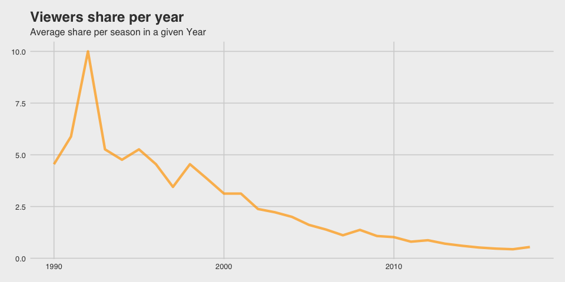
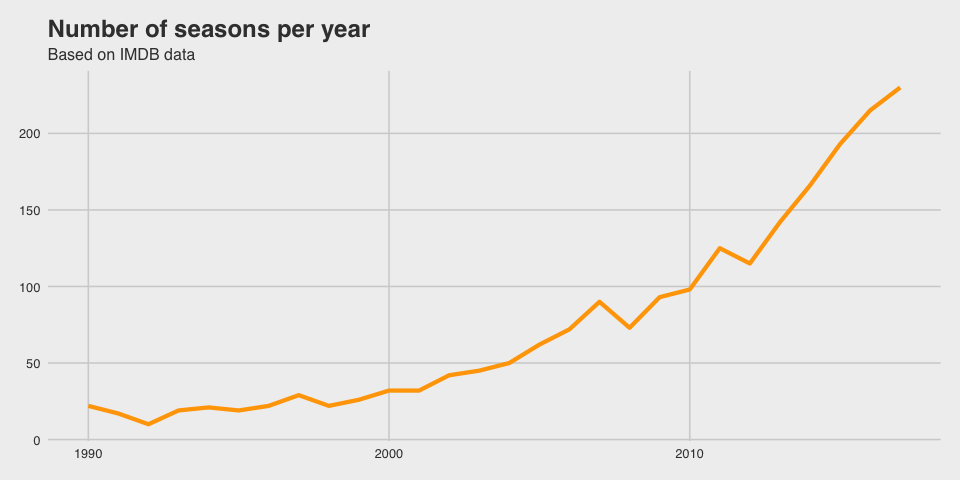
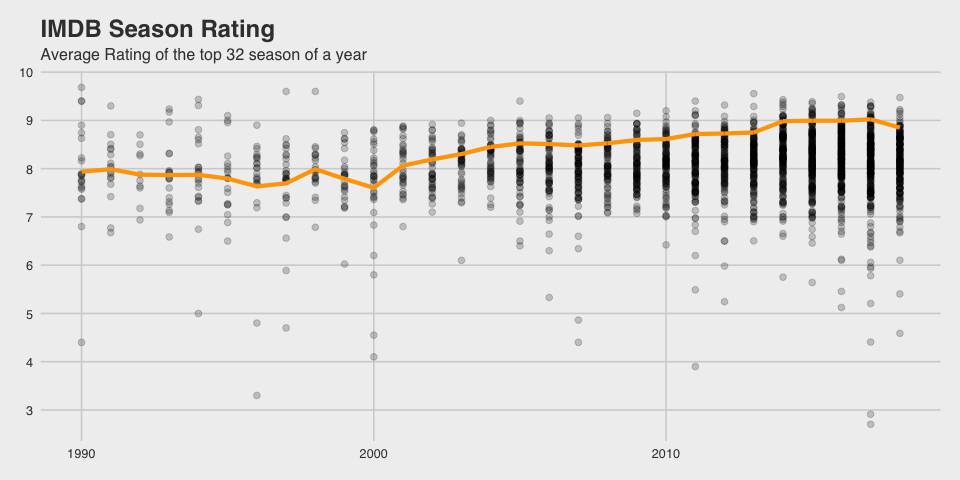

TV-Series
================
Georg Olm
1/10/2019

<!-- ```{r setup, include=FALSE, Echo = FALSE} -->

<!-- knitr::opts_chunk$set(echo = TRUE) -->

<!-- ``` -->

<!-- ```{r} -->

<!-- # series_ratings %>%  -->

<!-- #   group_by(title) %>%  -->

<!-- #   summarise(max_share = max(share), -->

<!-- #             mean_share = mean(share), -->

<!-- #             sd_share = sd(share), -->

<!-- #             n_season = n()) %>%  -->

<!-- #   filter(n_season > 1) %>%  -->

<!-- #   #arrange(desc(max_share)) -->

<!-- #   ggplot(aes(max_share, sd_share))+ -->

<!-- #     geom_point(alpha = 0.3)+ -->

<!-- #     xlim(0,10)+ -->

<!-- #     ylim(0,5) -->

<!-- ``` -->

## Share Development

How is the viewers share per season devolping over the years

<!-- --> The
avergae viewers share per season is generally decreasing. Maybe newer
series can’t attract a broad range of viewer or or maybe there are
better alternatives. People aren’t forced to watch the one season of
X-Files, that is running but can find their own niche. This might be
visible when looking at the number of seasons per year.

## Season Development

How are seasons developing in terms of quantity and quality
<!-- -->

The number of seasons per year is exponentially increasing. Without
further research: Around twenty seasons for the early 90’s century
appears pretty few for me. Maybe the data set is incomplete and becomes
more comprehensive for later years, which could strengthen the increase.
But nevertheless a strong increase can be seen.

Based on previous tidytuesday
[posts](https://twitter.com/hashtag/TidyTuesday?src=hash), we know, that
the average rating of a season is not really increasing. I will take a
look at the top 32 seasons per year - The total number of seasons in
2000. - to see if the average value of the best seasons increase. We
could speak of a golden era of series if we see enough series, that are
better and can happily ignore hundreds of weaker series.

## How are the the top series developing

<!-- -->

Generally, more series are produced and hence, more good series are
beneath them. The mean rating per year doesn’t apper to change much but
it is clearly visible, that more good/very good series are produced
today.
